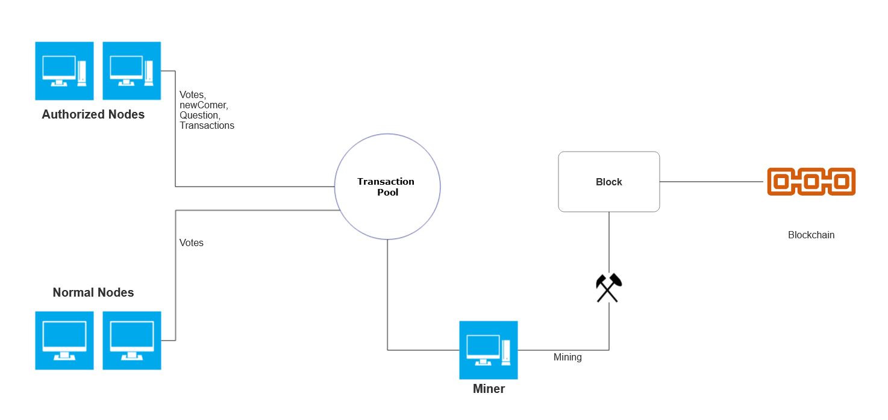
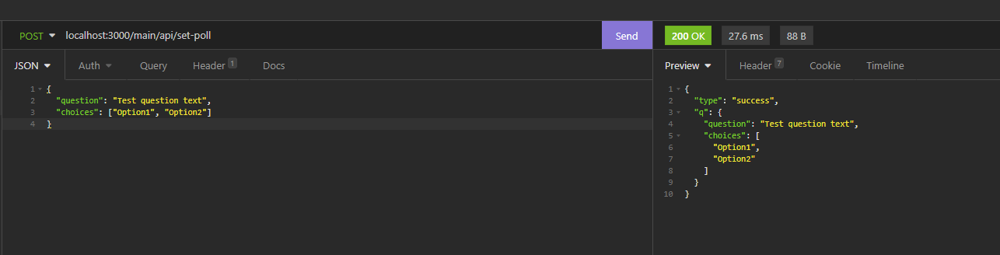
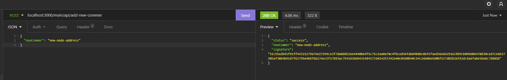
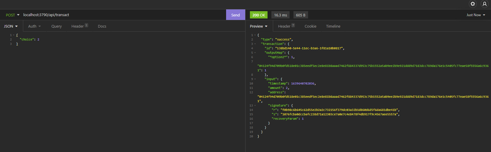
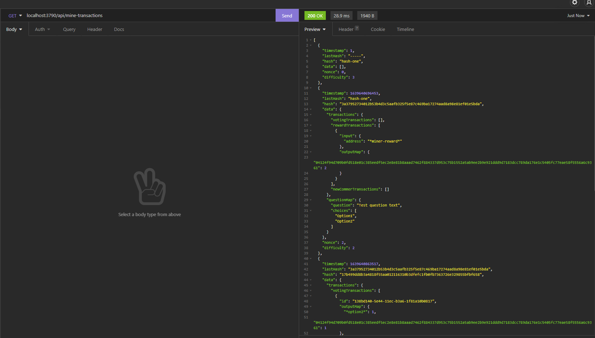

<p align="center">

</p>



<table >
   <tr>
     <td>
        
     </td>
     <td >
       
     </td>
   </tr>
   <tr>
     <td>
       
     </td>
     <td>
       
     </td>
   </tr>
</table>


# 🔖 About
## A decentralized voting system using blockchain technology
- Mining using Proof Of Work
- Synchronization using redis pub/sub

## 🚀 Features
- Polling
- Add new legit Voters 
- Cast your votes 
- Winners of the poll will get some extra voting points and losers will lose some points 

## 🔥 Getting Started

### Prerequisites

- <a href="https://redis.io/">Redis</a>
- <a href="https://nodejs.org/en/">Nodejs</a>

### Installation

- Fork the Repository

```
   $ git clone https://github.com/<your-username>/VoteChain.git
   $ cd VoteChain
   $ git remote add upstream https://github.com/adnan-shamsi/VoteChain.git
   $ npm install
   $ redis-server
   $ npm start                # for starting the root node
   $ npm run dev-peer         # starting other random nodes
```

## 🚀 Extra
- [view our sample mine chain  :chains: ](DemoChain.json)
